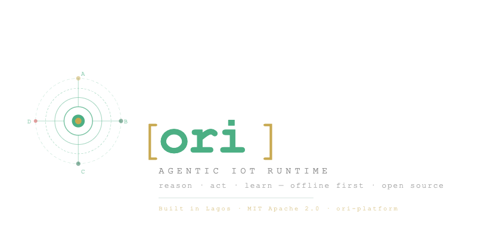

<div align="center">

  

  <h3><strong>Give your devices a brain.</strong></h3>

[](LICENSE)
[](https://python.org)
[](#)

</div>

---

# Ori — Agentic IoT Runtime

> **IoT devices do not need more data. They need to reason about that data — and act on it.**

Ori is an open-source, offline-first **agentic** runtime that gives physical devices the ability to **reason** about sensor data and take **autonomous physical actions** based on that reasoning. Built on the [Agents of Things (AoT)](https://ieeexplore.ieee.org/document/6920728) concept first documented in a 2013 IEEE paper, Ori is the first production platform that realises that vision with 2026 technology.

---

## The Difference

Every existing IoT platform does the same thing: collect data, apply a threshold, fire an alert, wait for a human. Sensors report numbers. Ori reasons about them — and acts.

```text
❌ Traditional IoT: "Current draw: 8.2A"
❌ Traditional IoT: "ALERT: threshold exceeded. Please investigate."

✅ Ori (Tier A): "Your AC unit has drawn 40% above baseline for three afternoons.
        Pattern: refrigerant depletion, not usage change.
        Estimated failure: 2 weeks.
        I've sent a service reminder to your WhatsApp."

         — sent autonomously, from a $55 Pi, with no internet

✅ Ori (Tier B): "Grid voltage dropped to 174V. I have switched to
inverter power automatically." ← Acted. Then told you.

✅ Ori (Tier C): "Critical fault detected on main circuit. I am
proposing to trip the breaker. Reply YES to approve
or NO to cancel. Auto-cancel in 5 minutes."
← Reasoned. Proposed. Awaiting you.

✅ Ori (Tier D): [Relay trips immediately]
"Dangerous overcurrent (52A on 10A circuit). Emergency
cutoff executed at 14:32." ← Safety. No waiting.
```

Ori is not a monitoring system with a language model attached. It is an agent that reasons and acts.

---

## What Ori is not

- Not a monitoring dashboard like Grafana — Ori acts, not just displays
- Not a rules engine like Node-RED — Ori reasons with LLMs, not just thresholds
- Not a cloud IoT platform like AWS IoT Core — Ori runs fully offline
- Not a notification system — alerts are Tier A, the least of what Ori does

---

## Architecture

```table
┌──────────────────────────────────────────────────────────────┐
│  Layer 6  Business       ori-cloud · dashboard · fleet       │
├──────────────────────────────────────────────────────────────┤
│  Layer 5  Application    Skills · Skills Hub · SDK           │
├──────────────────────────────────────────────────────────────┤
│  Layer 4  Reasoning+Action  Intelligence Elevator            │
│                             + Action Tier Framework          │
├──────────────────────────────────────────────────────────────┤
│  Layer 3  Middleware      Runtime · Event Loop · Dispatcher  │
├──────────────────────────────────────────────────────────────┤
│  Layer 2  Network         EventBus · Protocol Normaliser     │
├──────────────────────────────────────────────────────────────┤
│  Layer 1  Perception      HAL · GPIO · I2C · RS485 · MQTT    │
└──────────────────────────────────────────────────────────────┘
```

Layers 1–4 run on the device. **Layers 3 and 4 are inseparable** — the runtime always pairs a reasoning decision with an action decision. Layer 5 is the community. Layer 6 is the business.

Runs on a [$55 Raspberry Pi 4](https://raspberrypi.com). No internet required. No cloud subscription.

---

## Hardware Support

| Protocol            | Coverage                                     |
| ------------------- | -------------------------------------------- |
| GPIO (Raspberry Pi) | Wired sensors and relay control              |
| I2C / SPI           | Precision sensors: BME280, ADS1115, SCD40    |
| Modbus RTU (RS485)  | Industrial energy meters, PLCs, motor drives |
| MQTT                | WiFi-connected sensors via Mosquitto         |
| Zigbee              | Smart home sensors via zigpy                 |
| LoRaWAN             | Rural sensors up to 15km via ChirpStack      |
| psutil / sysfs      | PC and server health monitoring              |

---

## How It Works

Ori runs a paired decision system on every sensor event:

### The Intelligence Elevator — _What does this mean?_

```table
Tier 1  RULE ENGINE    microseconds · always available · safety triggers
Tier 2  LOCAL SLM      3-8 seconds  · fully offline    · everyday reasoning
Tier 3  GATEWAY LLM    1-3 seconds  · LAN only         · cross-device reasoning
Tier 4  CLOUD LLM      2-5 seconds  · internet         · deep analysis + reports
```

### The Action Tier Framework — _What should I do about it?_

```table
Tier A  INFORMATIONAL       Always autonomous
        Alerts, logs, reports — the agent acts without asking

Tier B  SOFT PHYSICAL        Autonomous by default, configurable
        Power source switching, thermostat adjustments, irrigation valves
        The agent acts and tells you what it did

Tier C  HARD PHYSICAL        Approval workflow — always
        Breaker trips, equipment shutdown, high-consequence control
        The agent reasons, proposes, and waits for your YES or NO

Tier D  SAFETY-CRITICAL      Always autonomous, cannot be overridden
        Dangerous overcurrent, thermal runaway, hazardous gas
        The agent acts first, notifies you immediately
```

The runtime picks the cheapest reasoning tier that can answer. The action tier determines whether it acts, asks, or moves immediately.

---

## Skills

Everything Ori does is a skill. A skill is a packaged agent behaviours with explicit action authority declarations written in YAML.

```yaml
# skills/energy-anomaly-detector/skill.yaml
triggers:
  - name: anomalous_draw
    condition: "load_current > (history.avg_24h('load_current') * 1.4)"
    action_tier: A # → autonomous WhatsApp with reasoning

  - name: grid_instability
    condition: "grid_voltage < 180 and inverter_battery > 0.4"
    action_tier: B # → switches source, tells you after

  - name: critical_fault
    condition: "load_current > rated_capacity * 3.0"
    action_tier: C # → "Trip breaker? Reply YES/NO"

  - name: dangerous_overcurrent
    condition: "load_current > rated_capacity * 5.0"
    bypass_llm: true
    action_tier: D # → cuts power. no waiting.
```

```bash
ori skill install energy-anomaly-detector   # official hub
ori skill install ./my-skill/               # local
ori skill install github.com/user/skill     # GitHub
```

Skills are community-written, cryptographically signed, and installable from the **[Skills Hub](https://hub.ori.dev)**.

---

## The Tier C approval workflow

When Ori proposes a hard physical action, this is what the operator receives:

```text
ORI ALERT — Action Required
Device: energy-monitor-ikeja-office-01
Time: Wednesday 14:32

OBSERVATION:
Load current has reached 38.4A — 3.8x the rated 10A capacity.
Sustained for 45 seconds and climbing.

REASONING:
Pattern consistent with a short circuit, not a temporary surge.
Active fault propagation detected.

PROPOSED ACTION:
Trip the main circuit breaker to prevent equipment damage or fire.

CONFIDENCE: 94%

Reply YES to approve  |  Reply NO to cancel
Auto-cancel in 5 minutes if no response.
```

The agent does the diagnosis. The operator approves or rejects a specific, fully-reasoned proposal.

---

## Try it now — no hardware needed

```bash
pip install ori-runtime
ori init my-laptop
ori skill install pc-system-health
ori start
# Ori reasons about your CPU, memory, and thermals.
# Sends a WhatsApp alert if your machine overheats.
```

---

## Roadmap

| Phase  | Timeline      | Milestone                                                                 |
| ------ | ------------- | ------------------------------------------------------------------------- |
| PoC    | Now → Month 3 | Energy skill with full action tier support deployed in Lagos. Demo video. |
| Launch | Month 3–9     | Public GitHub. Skills Hub. Action tier documented for community.          |
| Growth | Month 9–18    | Rust runtime. 500+ skills. ori-cloud Business. Enterprise pilots.         |
| Scale  | Month 18–36   | Global deployment. ORI Foundation. Hardware certification.                |

---

## Contributing

```bash
cat CLAUDE.md           # Read architecture and conventions first
pip install -e ".[dev]"
pytest tests/ -v
```

Read [CONTRIBUTING.md](CONTRIBUTING.md). First PR suggestions: new psutil sensor types — testable on any laptop, no hardware required.

---

<div align="center">

**Apache 2.0. Forever free.**

ori-cloud — the managed service — is how the project sustains itself.

[Docs](https://docs.ori.dev) · [Skills Hub](https://hub.ori.dev) · [Discord](https://discord.gg/oriplatform) · [X](https://x.com/oriplatform)

</div>
